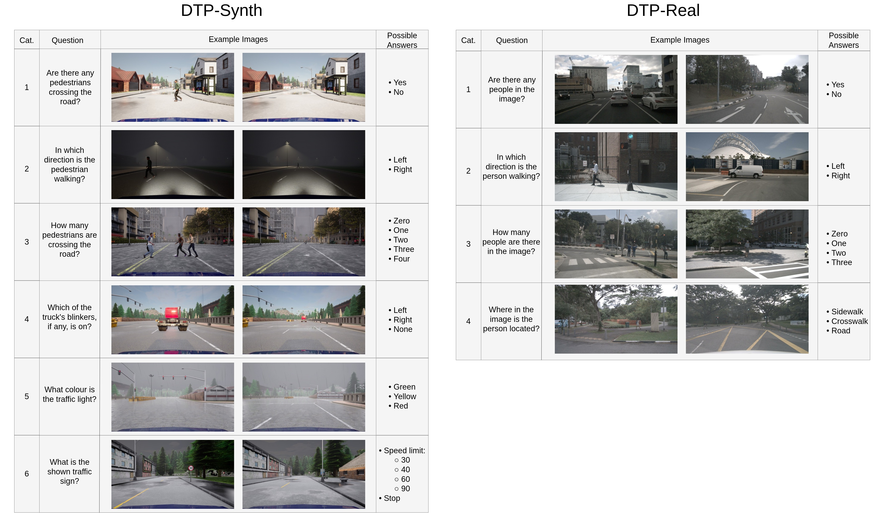

# Distance-Annotated Traffic Perception Question Answering (DTPQA)

## 📄 Paper & Dataset
- 📜 **Paper**: [Read here](link)  
- 📁 **Dataset**: [Access here](https://data.mendeley.com/datasets/9rj4kyrx9k/1)

This repository contains the code used to generate **DTPQA**, a Visual Question Answering (VQA) benchmark designed to evaluate the **perception capabilities of Vision-Language Models (VLMs)** in traffic scenes.  
DTPQA consists of two main components:  
- **DTP-Synth**, generated using [CARLA](https://github.com/carla-simulator/carla)  
- **DTP-Real**, generated on top of [nuScenes](https://www.nuscenes.org/) data.

## 📊 Dataset Overview

- **19,149** image–question pairs  
- Real and synthetic images  
- **10** data types  
- Multiple environments and weather conditions  
- Distance annotations for each object in question

## Code Structure

This repository provides scripts for both the **DTP-Synth** and **DTP-Real** datasets.  
See the corresponding directories for detailed instructions on how to run the generation pipelines.
